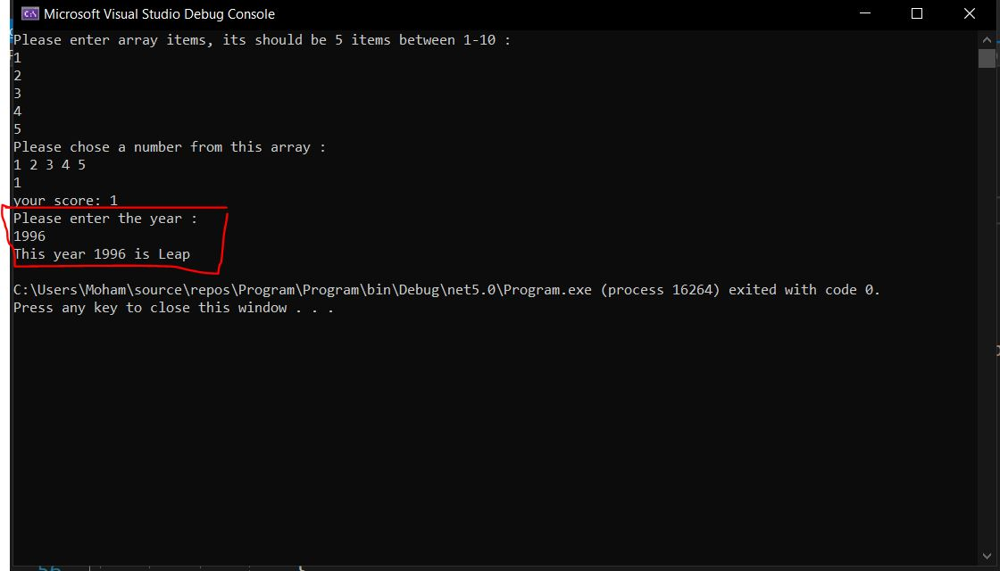
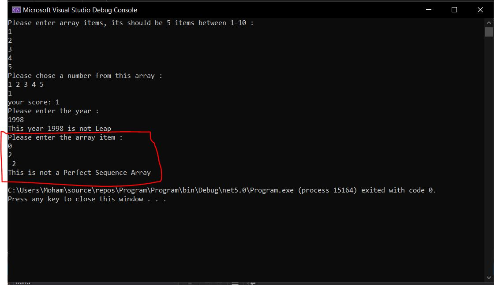
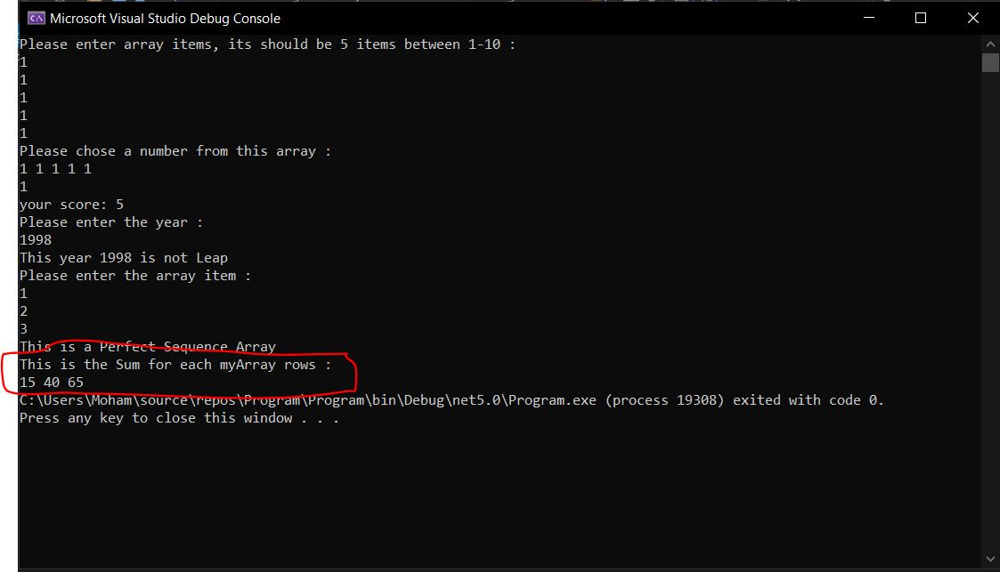

# Prework-CodeChallenges

## Array Max Result:

I have defined a function that takes an array and a selected number from the array, the function returns the sum of the selected number of occurrences inside the array,I also used try and catch to check the numbers entered

## Leap Year Calculator:
I have defined a function that take the year value, the function returns if this year is leap or not

## Perfect Sequence:
I have defined a function that take array, the function returns if this array have a Perfect Sequence or not

## Sum of Rows:
I have defined a function that take 2D array, the function returns the sum for each rows inside an array

