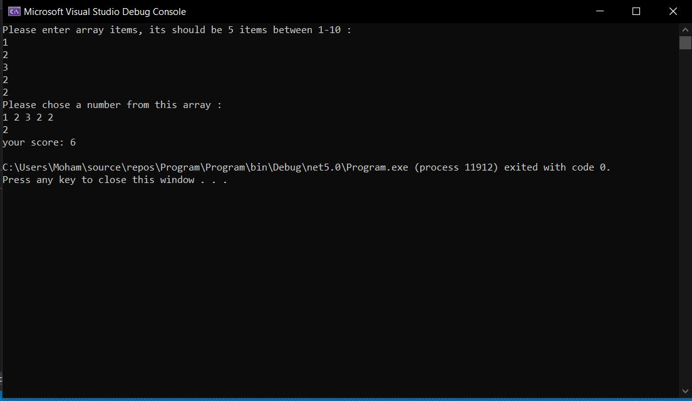

# Prework-CodeChallenges

## Array Max Result:

I have defined a function that takes an array and a selected number from the array, the function returns the sum of the selected number of occurrences inside the array,I also used try and catch to check the numbers entered

